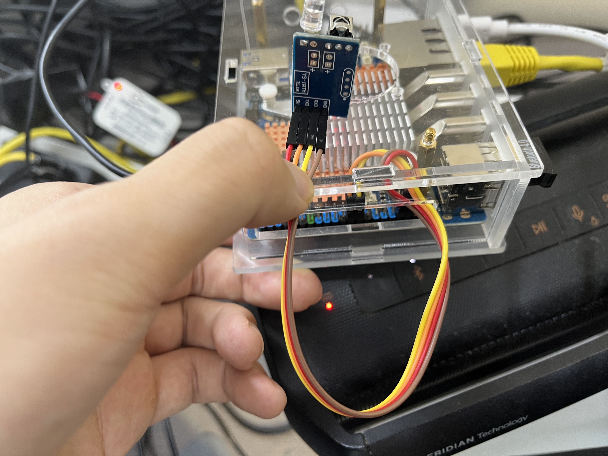

# Intro

A demo for using Orange Pi 5 Plus & YS-IRTM to send and receive IR to control the light.

# Hardware Demo



# Install

Using `sudo armbian-config` to switch on ttyS3 (System->Hardware->rk3588-uart3-m0/1)

Install the pyserial

```
pip3 install -r requirements.txt
```


# Usage

```
./light.py s # turn on/off my light
./light.py l # receving (for learning new commands)
./light.py b # make my light brighter
./light.py d # make my light darker
./light.py bb # brightest
./light.py dd # darkest
```

## MQTT

```
export MQTT_USERNAME="Wenyuan"
export MQTT_PASSWORD="*"

```

